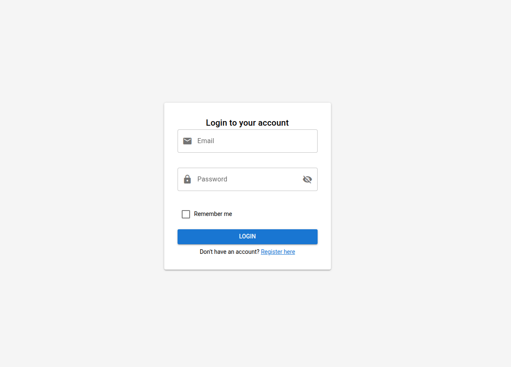
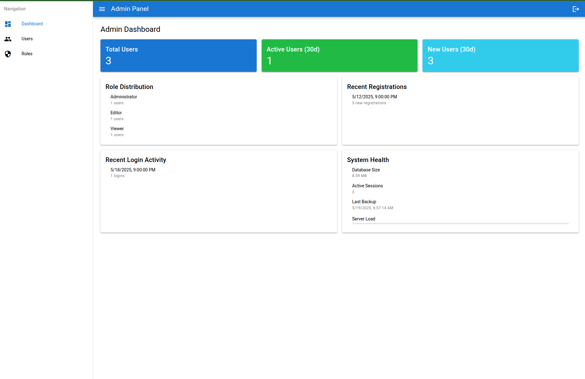
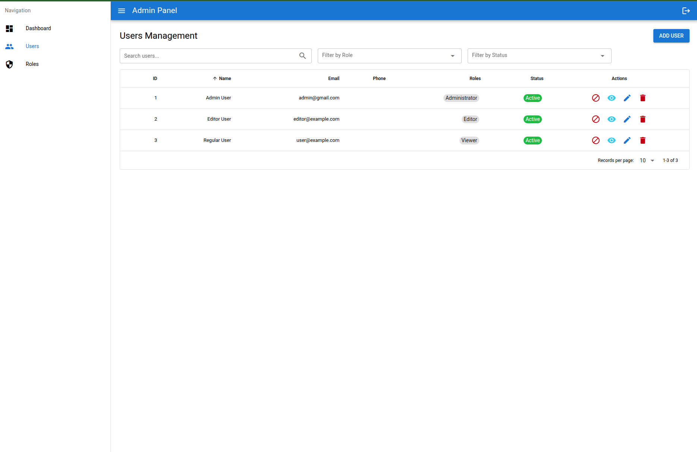
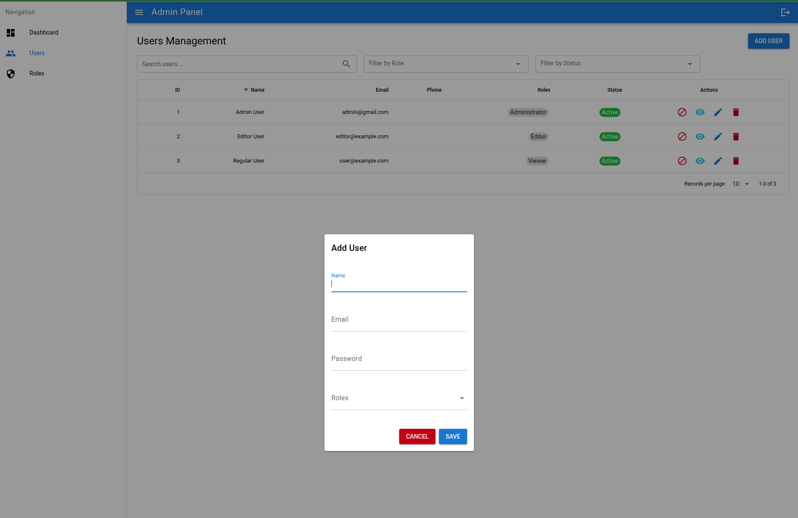
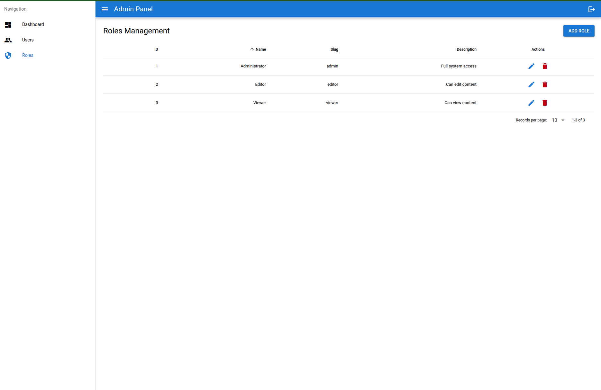
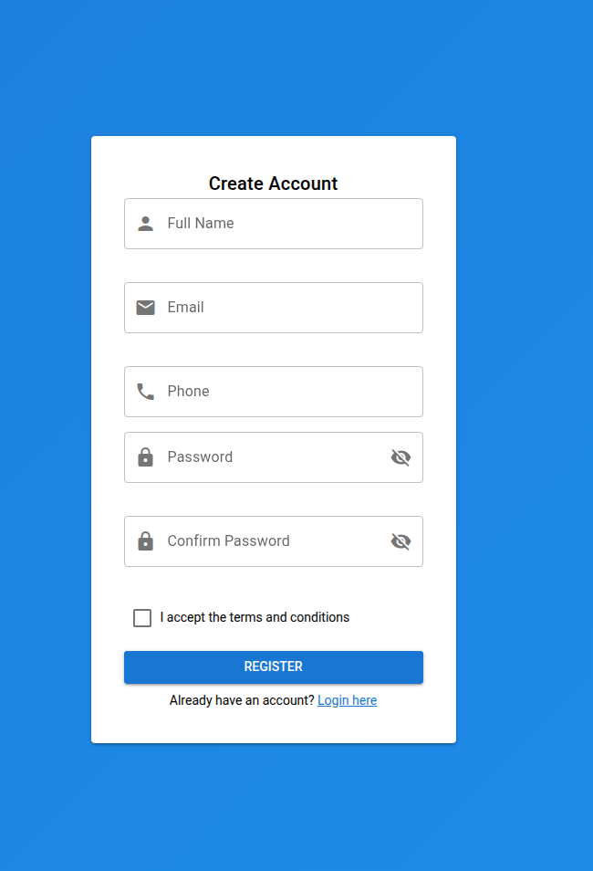

# 🚀 Laravel + Quasar Kubernetes Deployment

A modern, full-stack web application that combines the power of Laravel's robust backend framework with Quasar's elegant frontend framework. This application demonstrates a production-ready setup with Kubernetes deployment, featuring user authentication, role-based access control, and a responsive dashboard interface.

## 🌟 Key Features

- **Modern Tech Stack**
  - Backend: Laravel 10.x (PHP)
  - Frontend: Quasar Framework (Vue.js)
  - Database: PostgreSQL
  - Containerization: Docker
  - Orchestration: Kubernetes

- **Security & Authentication**
  - JWT-based authentication
  - Role-based access control (Admin, Editor roles)
  - Secure password handling
  - CSRF protection

- **User Management**
  - User registration and authentication
  - Role-based permissions
  - User activity tracking
  - Account status management

- **Production-Ready Infrastructure**
  - Containerized deployment
  - Kubernetes orchestration
  - Load balancing
  - High availability setup
  - Automated scaling capabilities

- **Development Features**
  - Hot-reload development environment
  - Docker-based local development
  - Comprehensive API documentation
  - Database migrations and seeding

## 🎯 Use Cases

This application serves as an excellent starting point for:
- Enterprise web applications
- Admin dashboards
- User management systems
- API-driven web applications
- Learning modern full-stack development

## 🛠️ Technology Stack

### Backend
- Laravel 10.x
- PostgreSQL
- JWT Authentication
- RESTful API Architecture

### Frontend
- Quasar Framework
- Vue.js 3
- Composition API
- Responsive Design

### Infrastructure
- Docker
- Kubernetes
- GitHub Container Registry
- Nginx

## 🔒 Security Features

- JWT token-based authentication
- Role-based access control
- Secure password hashing
- API rate limiting
- CORS protection
- Input validation and sanitization

## 🚀 Performance

- Optimized database queries
- Efficient caching mechanisms
- Load balancing
- Containerized deployment
- Scalable architecture

## 📱 Responsive Design

- Mobile-first approach
- Cross-browser compatibility
- Adaptive layouts
- Touch-friendly interface


## 🎨 User Interface

- Modern, clean design
- Intuitive navigation
- Responsive dashboard
- User-friendly forms
- Consistent styling

## 📊 Monitoring & Maintenance

- Health check endpoints
- Logging and monitoring
- Error tracking
- Performance metrics
- Easy deployment updates

This project demonstrates best practices in modern web development, combining powerful backend capabilities with a sleek, responsive frontend, all while maintaining security, scalability, and maintainability. It's an excellent foundation for building enterprise-grade web applications or learning modern full-stack development practices.

Would you like me to:
1. Add more specific technical details about any component?
2. Include information about specific features or implementations?
3. Add more sections to the description?

Let me know what aspects you'd like to emphasize or expand upon!

## Prerequisites

- Docker and Docker Compose
- Kubernetes cluster (e.g., Linode Kubernetes Engine)
- kubectl configured
- GitHub Container Registry (ghcr.io) account

## Quick Start

### 1. Local Development

```bash
# Clone the repositoryDashboard
git clone <repository-url>
cd k8s-laravel-quasar-deploy


# Start the containers
docker-compose up -d --build

# Install dependencies
docker-compose run --rm composer install

# Generate application key
docker-compose run --rm artisan key:generate

# Run migrations and seeders
docker-compose run --rm artisan migrate --seed
```

### 2. Default Users

The following users are created by the seeder:

- Admin User:
  - Email: admin@gmail.com
  - Password: password

- Editor User:
  - Email: editor@example.com
  - Password: password

## Deployment

### 1. Build and Push Images

```bash
# Build frontend image
docker build -t ghcr.io/<your_repository>/deploy-laravel-quasar-app/frontend:v1.0.1 -f Dockerfile.frontend .

# Build backend image
docker build -t ghcr.io/<your_repository>/deploy-laravel-quasar-app/backend:latest -f Dockerfile.backend .

# Push images to GitHub Container Registry
docker push ghcr.io/<your_repository>/deploy-laravel-quasar-app/frontend:v1.0.1
docker push ghcr.io/<your_repository>/deploy-laravel-quasar-app/backend:latest
```

### 2. Kubernetes Deployment

```bash
# Create namespace
kubectl apply -f kube-manifests/namespaces.yaml

# Create registry secret
kubectl create secret docker-registry ghcr-secret \
  --docker-server=ghcr.io \
  --docker-username=<your-username> \
  --docker-password=<your-password> \
  --namespace=production

# Deploy the application
kubectl apply -f kube-manifests/
```

### 3. Verify Deployment

```bash
# Check pods status
kubectl get pods -n production

# Check services
kubectl get services -n production

# Check ingress
kubectl get ingress -n production
```

### 4. Run Migrations in Production

```bash
# Get the backend pod name
kubectl get pods -n production -l app.kubernetes.io/name=laravel

# Run migrations
kubectl exec -n production -it <pod-name> -c app -- php artisan migrate
```

## Troubleshooting

### Common Issues

1. **Image Pull Issues**
   ```bash
   # Force image pull
   kubectl rollout restart deployment -n production frontend
   kubectl rollout restart deployment -n production backend
   ```

2. **Pod Issues**
   ```bash
   # Check pod logs
   kubectl logs -n production -l app.kubernetes.io/name=frontend
   kubectl logs -n production -l app.kubernetes.io/name=laravel

   # Describe pod for more details
   kubectl describe pod -n production -l app.kubernetes.io/name=frontend
   ```

3. **Database Connection**
   ```bash
   # Connect to database
   kubectl exec -it -n production <postgres-pod-name> -- psql -U test_user -d laravel_gke_db
   ```

## Maintenance

### Updating Images

1. Build and push new images
2. Update the deployment YAML with new image tags
3. Apply the changes:
   ```bash
   kubectl apply -f kube-manifests/frontend-deployment.yaml
   kubectl apply -f kube-manifests/backend-deployment.yaml
   ```

### Scaling

```bash
# Scale frontend deployment
kubectl scale deployment frontend -n production --replicas=2

# Scale backend deployment
kubectl scale deployment backend -n production --replicas=2
```

## Architecture

The application consists of:
- Frontend: Quasar application served by Nginx
- Backend: Laravel API
- Database: PostgreSQL
- All deployed on Kubernetes with proper networking and ingress configuration


### Development Guidelines

- Follow PSR-12 coding standards for PHP
- Use ESLint and Prettier for frontend code
- Write meaningful commit messages
- Keep pull requests focused and small
- Update tests and documentation

### Contact

For questions, suggestions, or collaboration:
- **Author**: Murilo Livorato
- **GitHub**: [murilolivorato](https://github.com/murilolivorato)
- **linkedIn**: https://www.linkedin.com/in/murilo-livorato-80985a4a/


## 🤝 Contributing

We love your input! We want to make this project even better, so feel free to:
- ⭐ Star the repository
- 🐛 Report bugs
- 💡 Suggest features
- 📝 Improve documentation
- 🔧 Submit pull requests

## 📄 License

This project is licensed under the MIT License - see the [LICENSE](LICENSE) file for details.


### Login Page


### Dashboard


### List Users


### Add Users


### List Roles


### Register Users



<div align="center">
  <h3>⭐ Star This Repository ⭐</h3>
  <p>Your support helps us improve and maintain this project!</p>
  <a href="https://github.com/murilolivorato/k8s-laravel-quasar-deploy
/stargazers">
    
  </a>
</div>